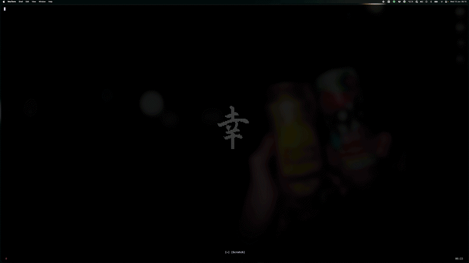

# dotfiles

Personal macOS configuration and tooling setup.



---

## System

```sh
# Disable accent press on hold
defaults write -g ApplePressAndHoldEnabled -bool false

# Remove dock autohide delay
defaults write com.apple.dock autohide-delay -float 0

# Make hidden apps translucent in dock
defaults write com.apple.Dock showhidden -bool YES && killall Dock
```

---

## Homebrew

```sh
/bin/bash -c "$(curl -fsSL https://raw.githubusercontent.com/Homebrew/install/HEAD/install.sh)"
echo 'eval "$(/opt/homebrew/bin/brew shellenv)"' >> ~/.zprofile
eval "$(/opt/homebrew/bin/brew shellenv)"
```

---

## Shell

### Oh My Zsh

```sh
sh -c "$(curl -fsSL https://raw.githubusercontent.com/ohmyzsh/ohmyzsh/master/tools/install.sh)"
```

### Starship Prompt

```sh
brew install starship
echo 'eval "$(starship init zsh)"' >> ~/.zshrc
```

### Plugins

```sh
git clone https://github.com/zsh-users/zsh-autosuggestions ${ZSH_CUSTOM:-~/.oh-my-zsh/custom}/plugins/zsh-autosuggestions
git clone https://github.com/zsh-users/zsh-syntax-highlighting.git ${ZSH_CUSTOM:-~/.oh-my-zsh/custom}/plugins/zsh-syntax-highlighting
```

`~/.zshrc`

```sh
plugins=(git zsh-autosuggestions zsh-syntax-highlighting web-search)
```

---

## CLI Tools

```sh
brew install fzf ripgrep bat lsd tree
```

| Tool        | Purpose                        |
| ----------- | ------------------------------ |
| `fzf`       | Fuzzy finder                   |
| `ripgrep`   | Fast grep                      |
| `bat`       | `cat` with syntax highlighting |
| `lsd`       | Modern `ls`                    |
| `tree`      | Directory tree                 |

---

## Terminal: WezTerm

```sh
brew install --cask wezterm
```

Config lives at `.config/wezterm/wezterm.lua`.

---

## Aliases & Functions

```sh
# ~/.zshrc

alias ls="lsd -hA --group-dirs first"
alias tree="tree -a -L 4 -h -f"
alias ip="ipconfig getifaddr en0"
alias detach="tmux detach"
alias tnew="tmux new -s"
alias attach="tmux attach -t"
alias gitnuke="git clean -df && git reset HEAD --hard"

# fuzzy cd
fcd() {
  local dir
  dir=$(fzf --select-1 --exit-0 --preview 'tree -C {} | head -200')
  [[ $? -eq 0 && -n "$dir" ]] && { [[ -d "$dir" ]] && cd "$dir" || cd "$(dirname "$dir")"; }
}

# fuzzy open in Finder
fop() {
  local file
  file=$(fzf --select-1 --exit-0 --preview 'bat --color=always {}') || return
  [[ -n "$file" ]] && open -a Finder "$(dirname "$file")"
}

# fuzzy open in VSCode
fvs() {
  local file
  file=$(fzf --select-1 --exit-0 --preview 'bat --color=always {}') || return
  [[ -n "$file" ]] && code "$(dirname "$file")"
}
```

---

## Neovim

Config lives at `.config/nvim/`. Plugin management via `pack`.

```sh
brew install neovim
```

---

## tmux

Config lives at `.config/tmux/tmux.conf`.

```sh
brew install tmux
```
